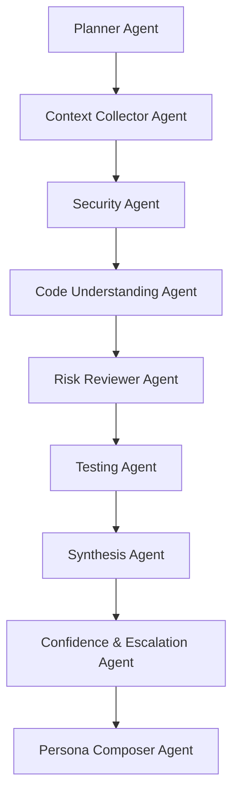

# AI Agents

## Implemented agent workflow
The core analysis graph is deterministic and stateful. Each agent writes explicit fields into graph state rather than improvising tool calls.

## Agent responsibilities
- `Planner Agent`: filters relevant files, chooses strategy and ranks important files.
- `Context Collector Agent`: enforces free-tier analysis limits and partial-mode entry.
- `Security Agent`: masks secrets and tags sensitive files.
- `Code Understanding Agent`: creates file-level summaries and reviewer focus hints.
- `Risk Reviewer Agent`: emits attention-level findings for logic, security and configuration areas.
- `Testing Agent`: produces test-impact recommendations.
- `Synthesis Agent`: creates the canonical PR brief.
- `Confidence & Escalation Agent`: lowers confidence when the analysis is partial and surfaces missing context.
- `Persona Composer Agent`: renders channel payloads for GitHub, Slack and Discord.

## Provider model
- `HeuristicAiProvider` is the active local provider.
- It conforms to the same contract a live `GroqProvider` would use:
  - `analyzeFiles`
  - `reviewRisks`
  - `planTesting`
  - `synthesize`

## Guardrails
- Secrets are masked before provider execution.
- The output never says "safe to merge".
- The summary always includes an AI disclaimer.
- Partial mode lowers confidence and adds explicit missing-context warnings.
