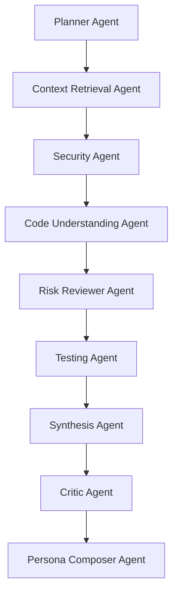

# AI Agents

## Implemented agent workflow
The core analysis graph is now a deterministic multi-agent system. Each agent owns a narrow task, writes typed fields into graph state, and hands the result to the next agent.

## Agent roles
- `Planner Agent`: classifies PR type, maps event type to review mode, chooses strategy, and decides whether the run should notify channels.
- `Context Retrieval Agent`: writes a compact context packet with related modules, key reviewer questions, and missing context that later agents must respect.
- `Security Agent`: combines deterministic masking with semantic security review to flag auth, config, dependency, and secret-sensitive paths.
- `Code Understanding Agent`: produces file summaries, business intent, reviewer focus, and a change type for each important file.
- `Risk Reviewer Agent`: turns file-level understanding into explicit risk findings with category, severity, and reviewer action.
- `Testing Agent`: converts the diff into targeted verification recommendations and prioritizes them.
- `Synthesis Agent`: assembles the canonical PR brief including event summary, next actions, reviewer posture, and important files.
- `Critic Agent`: calibrates confidence, missing context, escalation note, and channel publish policy before humans see the result.
- `Persona Composer Agent`: renders GitHub, Slack, and Discord payloads from the same canonical brief.

## Stateful outputs
The graph persists these typed artifacts through execution:

- `reviewPlan`
- `contextInsight`
- `securityFindings`
- `fileSummaries`
- `riskFindings`
- `testFindings`
- `brief`
- `critique`
- `channel payloads`

## Prompt design
Prompt builders live in [prompts.ts](/Users/AI/Vinuni/lab%206/packages/ai-core/src/prompts.ts). Each agent prompt defines:

- role and objective
- JSON-only response contract
- forbidden behavior such as claiming approval or safety
- event-aware guidance
- missing-context behavior

## Provider model
- `HeuristicAiProvider` is now a real structured fallback. It simulates each agent role with deterministic heuristics instead of acting like a placeholder.
- `GroqAiProvider` uses the same agent contract and validates every model response with Zod schemas before accepting it.
- If Groq returns invalid JSON or schema-mismatched output, the system falls back to the heuristic provider for that agent stage.

## Event-aware behavior
- `opened`, `reopened`, `ready_for_review`, `synchronize`: `full-review`
- `review_requested`, `review_request_removed`, `review_submitted`, `converted_to_draft`: `state-refresh`
- `closed`, `merged`: `closeout`

The event mode influences strategy, file selection, escalation, and whether notifications should be emitted.

## Guardrails
- Secrets are masked before any provider stage sees the diff.
- The system never outputs `safe to merge`, `approved`, or equivalent claims.
- `Critic Agent` reduces confidence when the run is partial or context is missing.
- `Persona Composer Agent` can suppress Slack and Discord payloads for low-signal events while still updating GitHub output.
- GitHub comments include event summary, next actions, reviewer posture, missing context, and escalation notes so reviewers can verify the AI output quickly.
