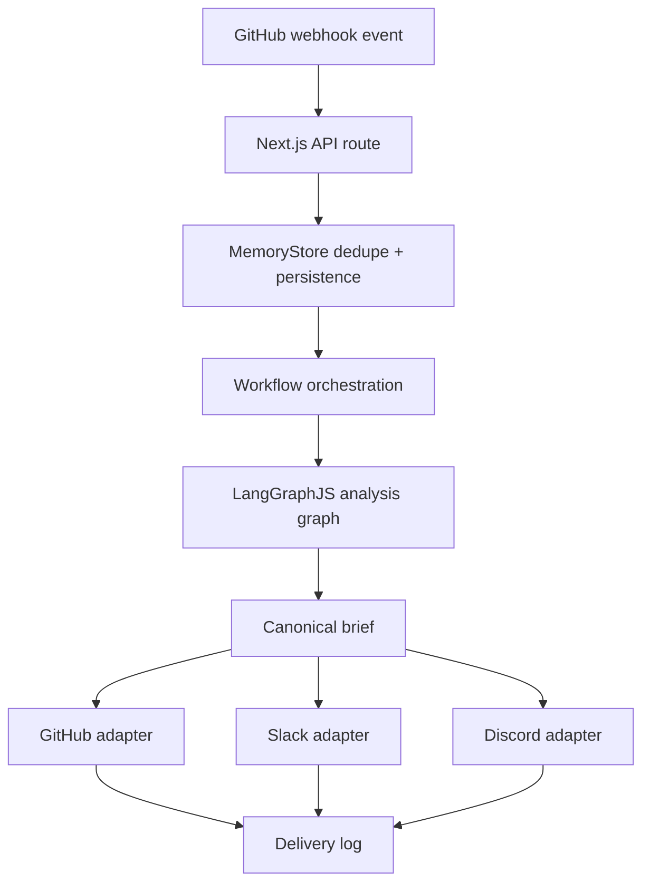

# Architecture

## Overview
The platform is split into four planes:

- `Control plane`: Next.js admin console, settings, analytics, health endpoints.
- `Event plane`: webhook intake, dedupe, orchestration trigger.
- `AI agent plane`: LangGraphJS stateful PR analysis workflow.
- `Delivery plane`: GitHub comment/check outputs plus Slack/Discord payload generation.

## Implemented topology

## Package map
- `apps/web`: UI and HTTP endpoints.
- `packages/shared`: domain contracts.
- `packages/db`: memory store and Prisma schema scaffold.
- `packages/ai-core`: provider contracts, filtering, masking, chunking, token budgeting.
- `packages/ai-graph`: LangGraphJS agent workflow.
- `packages/integrations`: transport adapters.
- `packages/workflows`: orchestration entrypoint and Inngest client scaffold.
- `packages/test-harness`: replayable end-to-end scenarios.

## Upgrade path
- Replace `MemoryStore` with Prisma-backed repositories.
- Swap fake adapters for live GitHub App, Slack OAuth and Discord bot adapters.
- Move the workflow trigger from direct function invocation to managed Inngest functions.
- Keep the LangGraphJS graph intact; only the surrounding adapters change.
